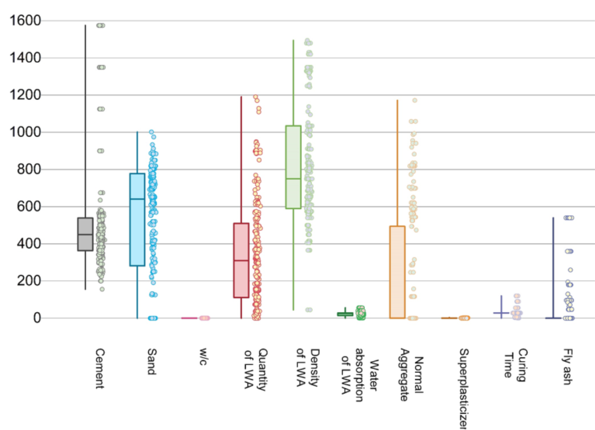

---
title: Machine Learning-Based Optimization Of The Mix Design Of Lightweight Concrete For Enhanced Mechanical Properties
keywords:
- markdown
- publishing
- manubot
lang: en-US
date-meta: '2024-09-27'
author-meta:
- Ayyan Iqbal
- Shayan Khan
- Dhatrika Varma Borukati
header-includes: |
  <!--
  Manubot generated metadata rendered from header-includes-template.html.
  Suggest improvements at https://github.com/manubot/manubot/blob/main/manubot/process/header-includes-template.html
  -->
  <meta name="dc.format" content="text/html" />
  <meta property="og:type" content="article" />
  <meta name="dc.title" content="Machine Learning-Based Optimization Of The Mix Design Of Lightweight Concrete For Enhanced Mechanical Properties" />
  <meta name="citation_title" content="Machine Learning-Based Optimization Of The Mix Design Of Lightweight Concrete For Enhanced Mechanical Properties" />
  <meta property="og:title" content="Machine Learning-Based Optimization Of The Mix Design Of Lightweight Concrete For Enhanced Mechanical Properties" />
  <meta property="twitter:title" content="Machine Learning-Based Optimization Of The Mix Design Of Lightweight Concrete For Enhanced Mechanical Properties" />
  <meta name="dc.date" content="2024-09-27" />
  <meta name="citation_publication_date" content="2024-09-27" />
  <meta property="article:published_time" content="2024-09-27" />
  <meta name="dc.modified" content="2024-09-27T08:00:38+00:00" />
  <meta property="article:modified_time" content="2024-09-27T08:00:38+00:00" />
  <meta name="dc.language" content="en-US" />
  <meta name="citation_language" content="en-US" />
  <meta name="dc.relation.ispartof" content="Manubot" />
  <meta name="dc.publisher" content="Manubot" />
  <meta name="citation_journal_title" content="Manubot" />
  <meta name="citation_technical_report_institution" content="Manubot" />
  <meta name="citation_author" content="Ayyan Iqbal" />
  <meta name="citation_author_institution" content="University of Illinois" />
  <meta name="citation_author" content="Shayan Khan" />
  <meta name="citation_author_institution" content="University of Illinois" />
  <meta name="citation_author" content="Dhatrika Varma Borukati" />
  <meta name="citation_author_institution" content="University of Illinois" />
  <link rel="canonical" href="https://uiceds.github.io/project-team-ads/" />
  <meta property="og:url" content="https://uiceds.github.io/project-team-ads/" />
  <meta property="twitter:url" content="https://uiceds.github.io/project-team-ads/" />
  <meta name="citation_fulltext_html_url" content="https://uiceds.github.io/project-team-ads/" />
  <meta name="citation_pdf_url" content="https://uiceds.github.io/project-team-ads/manuscript.pdf" />
  <link rel="alternate" type="application/pdf" href="https://uiceds.github.io/project-team-ads/manuscript.pdf" />
  <link rel="alternate" type="text/html" href="https://uiceds.github.io/project-team-ads/v/a85756c6584e051db91d170bb37786e25517e357/" />
  <meta name="manubot_html_url_versioned" content="https://uiceds.github.io/project-team-ads/v/a85756c6584e051db91d170bb37786e25517e357/" />
  <meta name="manubot_pdf_url_versioned" content="https://uiceds.github.io/project-team-ads/v/a85756c6584e051db91d170bb37786e25517e357/manuscript.pdf" />
  <meta property="og:type" content="article" />
  <meta property="twitter:card" content="summary_large_image" />
  <link rel="icon" type="image/png" sizes="192x192" href="https://manubot.org/favicon-192x192.png" />
  <link rel="mask-icon" href="https://manubot.org/safari-pinned-tab.svg" color="#ad1457" />
  <meta name="theme-color" content="#ad1457" />
  <!-- end Manubot generated metadata -->
bibliography:
- content/manual-references.json
manubot-output-bibliography: output/references.json
manubot-output-citekeys: output/citations.tsv
manubot-requests-cache-path: ci/cache/requests-cache
manubot-clear-requests-cache: false
...

## Authors

+ **Ayyan Iqbal**
   
    · {.inline_icon width=16 height=16}
    [maiqbal2](https://github.com/maiqbal2)
     
  <small>
     University of Illinois
  </small>

+ **Shayan Khan**
   
    · {.inline_icon width=16 height=16}
    [shayank491](https://github.com/shayank491)
     
  <small>
     University of Illinois
  </small>

+ **Dhatrika Varma Borukati**
   
    · {.inline_icon width=16 height=16}
    [DeeVarma24](https://github.com/DeeVarma24)
     
  <small>
     University of Illinois
  </small>

## Project Proposal {.page_break_before}

The escalating global population drives the increasing demand for concrete, thereby fostering the development and adoption of Lightweight Aggregate (LWA)-based Lightweight Concrete (LWC). The widespread availability of LWAs, coupled with straightforward and conventional casting techniques, has facilitated industry-wide acceptance [@doi:10.3390/su15010641]. LWC has found extensive applications in lightweight infill panels, structural concrete, and precast concrete. Notably, LWC achieves comparable compressive strength to traditional concrete in specific scenarios, albeit with a 25-35% reduction in density [@doi:10.3390/app11020800]. This reduction yields additional benefits, including minimized foundation steel requirements, lower transportation costs, and decreased construction expenditures, rendering LWC a promising solution for sustainable and cost-effective infrastructure development.
A significant obstacle in the widespread adoption of Lightweight Concrete (LWC) lies in its intricate mix design process. Unlike Normal-Weight Concrete (NWC), which relies on established codes and iterative fine-tuning, LWC lacks standardized design guidelines. Furthermore, optimizing LWC's density while maintaining compressive and tensile strength poses a substantial challenge due to its sensitive nature, where minor mix design adjustments drastically impact mechanical properties. The complexity is compounded by the varied shapes, sizes, and densities of LWAs, which significantly influence the mix design. In contrast, NWC aggregates exhibit relatively consistent properties.
To address this challenge, a machine learning (ML) framework can be employed to predict LWA concrete's mechanical properties, including compressive strength, tensile strength, and density. The development of user-friendly tools, leveraging these ML models, would facilitate iterative design optimization and trial-and-error experimentation for researchers working on specialized LWC mix designs.
This predictive tool would not only streamline LWC mix design hence enhancing accuracy in mechanical property prediction but expedite the development of tailored LWC solutions for specific applications. By integrating ML and materials science, this innovative approach would overcome existing design complexities and unlock LWC's full potential.
For the CEE-492 semester project, our team objectives are to develop and compare the performance of Artificial Neural Networks (ANN), Gaussian Process Regression (GPR), and Decision Trees in predicting the mechanical properties of Lightweight Concrete (LWC), specifically density, compressive strength, and tensile strength. Initially, relevant data from published online articles would be collected, followed by data preprocessing to ensure consistency and quality. Next, we identify 10 influential input parameters governing LWC mix design through a comprehensive literature review of the latest published review articles. An exploratory data analysis (EDA) is then conducted to uncover trends and relationships within the data. Subsequently, the preprocessed data is divided into training (~70-80%) and testing sets (~20-30%). The training data is then normalized and scaled to optimize model performance.
Then the team aims to train the ANN, GPR, and Decision Tree models on the training data, fine-tuning hyperparameters through cross-validation and grid search. Model evaluation is performed on the testing data using the statistical performance indicators i.e., such as mean squared error (MSE), R-squared (R²), and mean absolute error (MAE). Finally, we compare the performance of the trained models and select the best-performing algorithm. The formulas for the performance metrics are mentioned below in Table 1.

Table 1. Mathematical formulation of the statistical performance indicators used in the report.

{#fig:Eq}

A longstanding controversy surrounds the efficacy and reliability of Machine Learning (ML) and Artificial Intelligence (AI)--based models, with critics labeling them as "black boxes" that merely identify patterns without providing meaningful insights. To address concerns regarding overfitting and model interpretability, we aim to explain or results by employing local explanation techniques, specifically Partial Dependence Plots (PDP) and Shapley Additive Explanations (SHAP). These methods decipher the relationships between individual input parameters and the model's output, demystifying the "black box" nature of ML models, validating their reliability and accuracy, and identifying potential biases. In the figure, a complete overview of the whole project is depicted pictorially.

Figure 1. A flowchart explaining the sequence of tasks in the project.

### Dataset description

The data set attached has been collected by the team members from all the scholarly articles from Scopus. The search query used for finding articles was “{Lightweight} AND {concrete} AND {aggregate} AND {strength} AND {density} AND {ML}”. The authors have collected 500 data points from over 50 articles. The data set has the quantities of Cement, sand, fly ash (FA), the density of lightweight aggregate, water absorption of lightweight aggregate, superplasticizer, curing time, and the amount of normal aggregate (normal agg.), as input parameters while the compressive strength, split tensile strength, and density of the concrete were taken as output parameters. The first test columns of the dataset correspond to inputs while the last three correspond to output. All the quantities were normalized by the cement quantity before the start of the analysis. The input and output parameters along with their units have been mentioned below in Table 2 as well.

Table 2. Input and output parameters of the dataset along with their units.

| Parameters | Categories (I/O) |
|:-----------------:|:-------------:|
| Binder (kg/m3) | I |
| Fine agg. (kg/m3) | I |
| w/b | I |
| LW agg. (kg/m3) | I |
| LW agg. density (kg/m3) | I |
| LW agg. water absorption (%) | I |
| NW agg. (kg/m3) | I |
| HRWR (% of binder) | I |
| Curing Time (days) | I |
| Fly Ash (kg/m3) | I |
| Compressive Strength of LW concrete (MPa) | O |
| Split Tensile Strength of LW concrete (MPa) | O |
| Density of LW concrete (kg/m3) | O |

* I = Input
* O = Output
* LW = Lightweight 
* NW = Normal weight
* w/b = water to binder ratio
* HRWR = High range water reducer

### References {.page_break_before}

